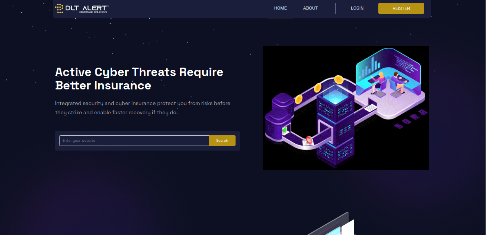
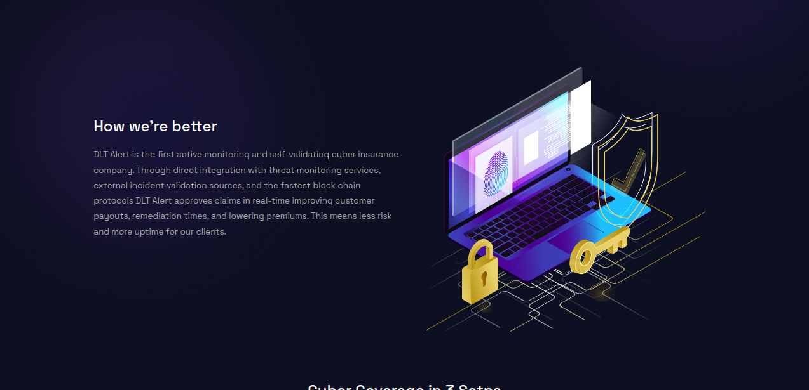
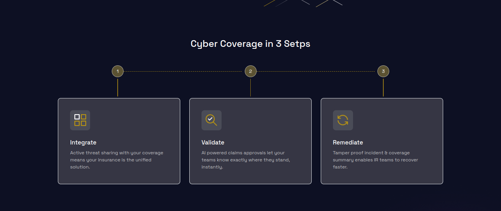
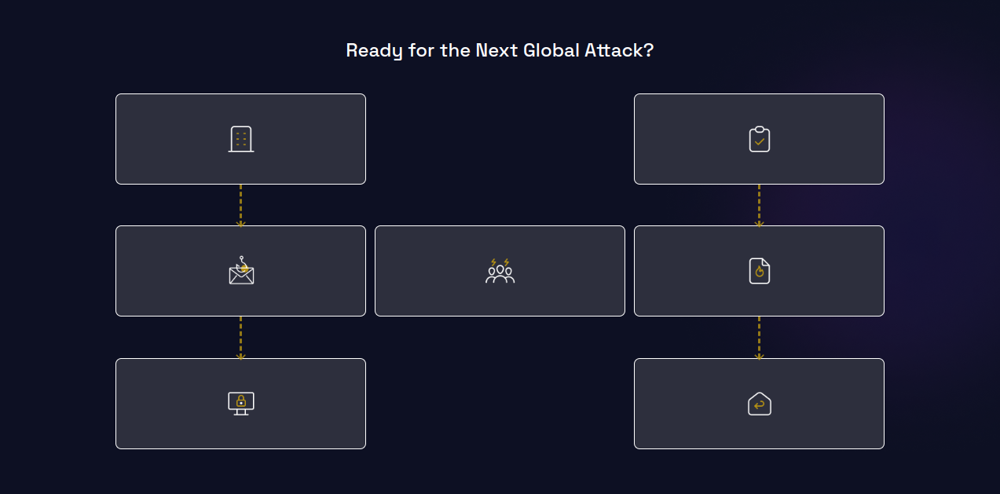
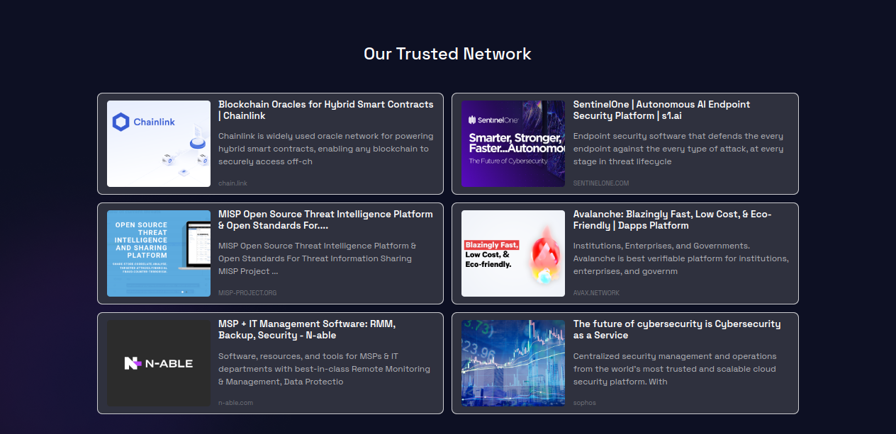
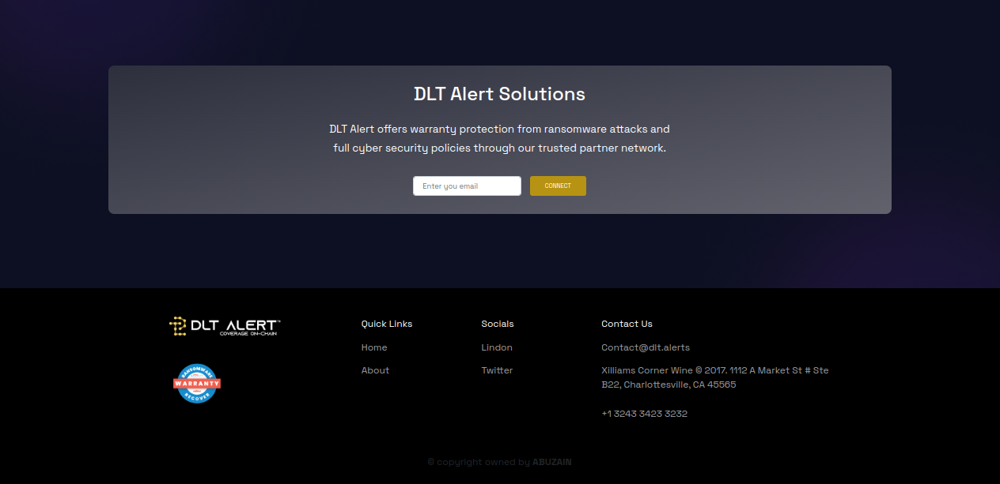

# DLT Alert

[Live Demo](https://dapper-basbousa-1e8675.netlify.app/)

I worked on this project during my tenour at Enigimatix. DLT Alert is
the first active monitoring and self-validating cyber insurance
company. Through direct integration with threat monitoring services,
external incident validation sources, and the fastest block chain
protocols DLT Alert approves claims in real-time improving customer
payouts, remediation times, and lowering premiums. This means less
risk and more uptime for our clients.and it can help you a lot during
you learing journey.

## if you are looking for a project where you can learn HTML, CSS3, Web desing, Advanced css patterns, Responsive, Boostraap Layouts and much more then this is the best project to look at

##### . Please checkout my fiverr account if you want to hire me

- [Find me on fiver ](https://www.fiverr.com/zainbinramzan/develop-web-applications-with-mern-stack-react-node-express-moongodbplugin-react/README.md)
- [Find me on linkedin](https://www.linkedin.com/in/abu-zain-html-css-javascipt-developer/)

##### Technologies used CSS3 + HTML5 + Bootstrap

